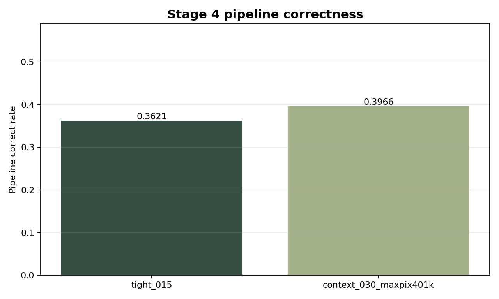
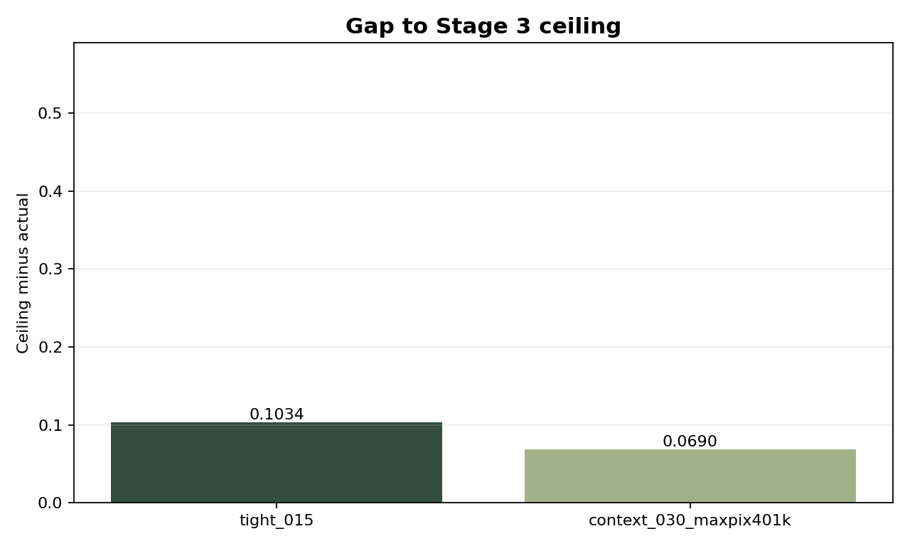
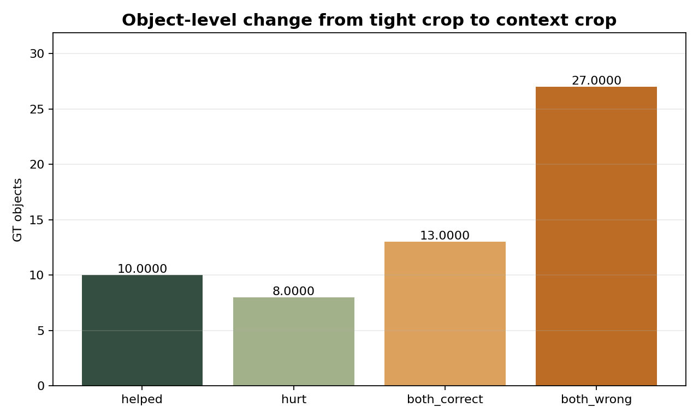
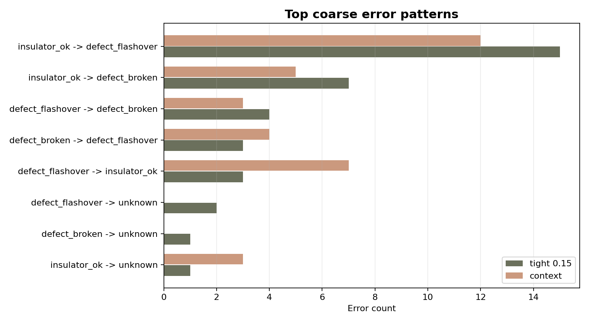

# Stage 4 Context Comparison

Compared runs: `tight_015` vs `context_030_maxpix401k`.

## Headline

- Tight crop pipeline correctness: `21/58 = 0.3621`.
- Context crop pipeline correctness: `23/58 = 0.3966`.
- Clean Stage 3 ceiling: `0.4655`.
- Object-level changes: `10` helped, `8` hurt.

The context crop improves total Stage 4 correctness, but the gain is small and comes with a class trade-off.

## Metrics

| run | pipeline_correct_total | pipeline_correct_rate | vlm_correct_rate_among_good_pred_crops | ceiling_correct_rate | ceiling_vs_actual_gap |
| --- | --- | --- | --- | --- | --- |
| tight_015 | 21 | 0.3621 | 0.3684 | 0.4655 | 0.1034 |
| context_030_maxpix401k | 23 | 0.3966 | 0.4035 | 0.4655 | 0.0690 |

## Per-Class Accuracy

| gt_coarse_class | n | tight_correct | tight_acc | context_correct | context_acc | delta_context_minus_tight |
| --- | --- | --- | --- | --- | --- | --- |
| defect_broken | 6 | 2 | 0.3333 | 2 | 0.3333 | 0.0000 |
| defect_flashover | 20 | 11 | 0.5500 | 10 | 0.5000 | -0.0500 |
| insulator_ok | 32 | 8 | 0.2500 | 11 | 0.3438 | 0.0938 |

## Error Pattern Shift

| gt_coarse_class | pred_vlm_coarse_class | tight_count | context_count | delta_context_minus_tight |
| --- | --- | --- | --- | --- |
| insulator_ok | defect_flashover | 15 | 12 | -3 |
| insulator_ok | defect_broken | 7 | 5 | -2 |
| defect_flashover | defect_broken | 4 | 3 | -1 |
| defect_flashover | insulator_ok | 3 | 7 | 4 |
| defect_broken | defect_flashover | 3 | 4 | 1 |
| defect_flashover | unknown | 2 | 0 | -2 |
| insulator_ok | unknown | 1 | 3 | 2 |
| defect_broken | unknown | 1 | 0 | -1 |

## Helped / Hurt Cases

| bucket | count |
| --- | --- |
| helped | 10 |
| hurt | 8 |
| both_correct | 13 |
| both_wrong | 27 |

Full case list: `helped_hurt_cases.csv`.

## Charts

## Interpretation

The best current input strategy candidate is `padding_ratio=0.30` with `max_pixels=401408`.
It is more useful than the tight crop because it closes part of the Stage 3-to-Stage 4 gap.
It should not be interpreted as solving VLM semantics: flashover-vs-normal confusion remains the key bottleneck.
